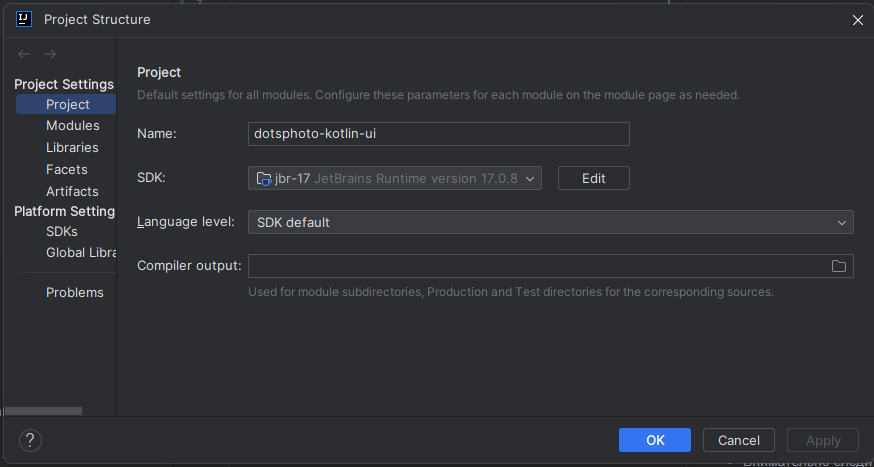
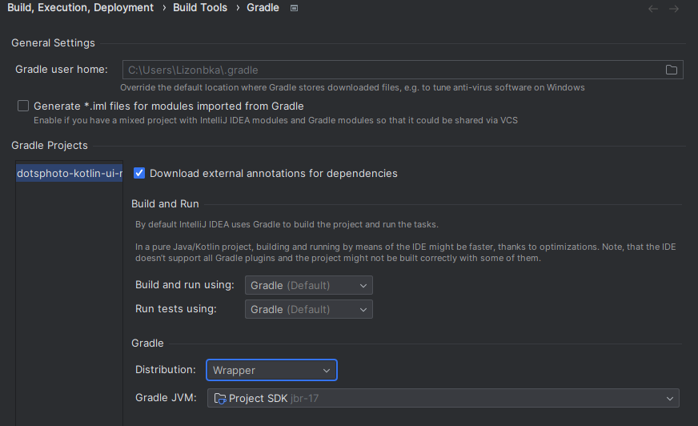

# dotsphoto-kotlin-ui
Постарался описать здесь особенности настройки окружения и работы с проектом, обязательно к прочтению

# Как работать с проектом

## Дисклеймер
Работаем ТОЛЬКО в Intellij IDEA Ultimate (лицензия), для модуля под андроид допускается Android Studio, но все остальное ИСКЛЮЧИТЕЛЬНО в Intellij Idea Ultimate.

## Как приступить написанию кода
Первым делом, после клонирования проекта, не обходимо дождаться, пока Gradle скачает все что хочет и прогрузит все что может.

В это время можно и нужно:
- Внимательно следить за уведомлениями в IDE, и скачивать всё что предложат. Нет какой-то SDK - качаем, нет какого-то плагина - качаем, все что Gradle попросит - качаем
- Установить SDK проекта в любую JDK 17 версии. Для этого жмем Ctrl+Alt+Shift+S, попадаем в меню Project Structure
Тут выбираем опцию Project, и в поле SDK указываем любую JDK 17 версии, там же в выборе можно скачать такую.
- Зайти в настройки Gradle Ctrl+Alt+S -> Build, Execution, Deployment | Build Tools | Gradle или кнопка шестеренки в боковом меню

После чего в открывшемся окне настроек в поле Gradle JVM ставим вариант Project SDK
- Скорее всего, для того чтобы Gradle проект опознался как живой, понадобится переменная ANDROID_HOME, которая будет указывать на Android SDK на локальной машине.
Можно попытаться без него, но если где-то в логах или в уведомлениях будет требование создать переменную среды ANDROID_HOME - делаем

При любой неполадке в проекте жмем на кнопку обновления (находится в боковом меню Gradle, самая первая кнопка).
Это перезагружает и пересобирает Gradle проект, что либо решает проблему, либо выводит в лог ошибку, которая мешает.
Но по-хорошему, после пунктов выше, проблем быть не должно

## Как запускать код

### Disclaimer

Все команды для Gradle рекомендую запускать либо через боковую панель, либо через меню запуска, открывающееся при двойном нажатии на Ctrl.
Это дает гарантию, что команды запускаются на Gradle, который настроен в этом проекте, а не у вас локально.

### Десктоп
Используем команду (копируем в меню, которое на двойной Ctrl)
```
gradle desktopApp:run
```

Как работает этот запуск - не исследовал, но вроде как это отладочный режим и все будет гуд.

После первого использования в боковом меню Gradle в проекте desktopApp должна появиться опция Run Configurations, где будет лежать эта конфигурация запуска.

### Веб
Используем команду (копируем в меню, которое на двойной Ctrl)
```
gradle web:jsBrowserDevelopmentRun --continuous
```

Запускает приложение в дев режиме, параметр --continuous отвечает за continuous integration continuous deployment, то есть автоматическая подгрузка изменений из IDE (у меня это происходит, когда фокус с окна IDE переходит на другое окно)

После первого использования в боковом меню Gradle в проекте desktopApp должна появиться опция Run Configurations, где будет лежать эта конфигурация запуска.

### Андроид
Тут черт ногу сломит, но у меня Intellij Idea сама сформировала конфигурацию запуска для этого, поэтому подсказать не могу.
Разберемся по факту, тут допишу.

## Сборка production билдов
Work In Progress

## Деплой для веба
Work In Progress