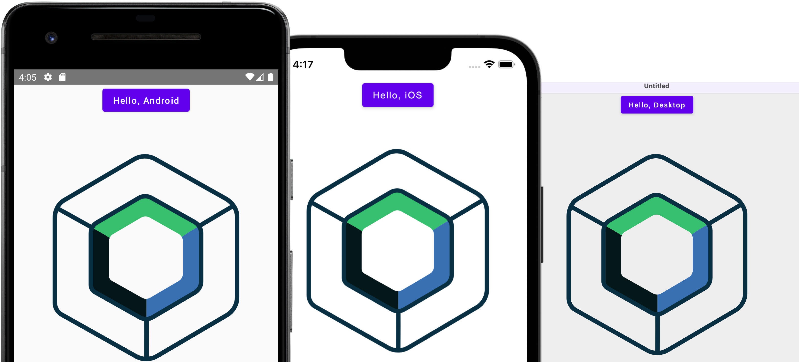
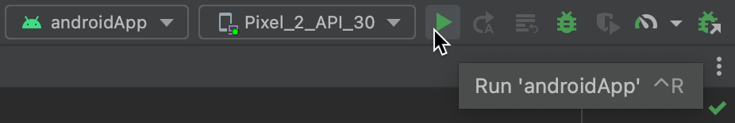

[](https://confluence.jetbrains.com/display/ALL/JetBrains+on+GitHub)
[](https://opensource.org/licenses/Apache-2.0)
# [Compose Multiplatform](https://github.com/JetBrains/compose-multiplatform) application

> **Note**
> The iOS part of Compose Multiplatform is in Alpha. It may change incompatibly and require manual migration in the
> future.
> If you have any issues, please report them on [GitHub](https://github.com/JetBrains/compose-multiplatform/issues).

You can use this template to start developing your
own [Compose Multiplatform](https://github.com/JetBrains/compose-multiplatform#readme) application targeting desktop,
Android, and iOS.
Follow our tutorial below to get your first Compose Multiplatform app up and running.
The result will be a [Kotlin Multiplatform](https://kotlinlang.org/docs/multiplatform.html) project that uses the
Compose Multiplatform UI framework.



## Set up the environment

> **Warning**
> You need a Mac with macOS to write and run iOS-specific code on simulated or real devices.
> This is an Apple requirement.

To work with this template, you need the following:

* A machine running a recent version of macOS
* [Xcode](https://apps.apple.com/us/app/xcode/id497799835)
* [Android Studio](https://developer.android.com/studio)
* The [Kotlin Multiplatform Mobile plugin](https://plugins.jetbrains.com/plugin/14936-kotlin-multiplatform-mobile)
* The [CocoaPods dependency manager](https://kotlinlang.org/docs/native-cocoapods.html)

### Check your environment

Before you start, use the [KDoctor](https://github.com/Kotlin/kdoctor) tool to ensure that your development environment
is configured correctly:

1. Install KDoctor with [Homebrew](https://brew.sh/):

    ```text
    brew install kdoctor
    ```

2. Run KDoctor in your terminal:

    ```text
    kdoctor
    ```

   If everything is set up correctly, you'll see valid output:

   ```text
   Environment diagnose (to see all details, use -v option):
   [✓] Operation System
   [✓] Java
   [✓] Android Studio
   [✓] Xcode
   [✓] Cocoapods
   
   Conclusion:
     ✓ Your system is ready for Kotlin Multiplatform Mobile development!
   ```

Otherwise, KDoctor will highlight which parts of your setup still need to be configured and will suggest a way to fix
them.

## Examine the project structure

Open the project in Android Studio and switch the view from **Android** to **Project** to see all the files and targets
belonging to the project:


Your Compose Multiplatform project includes 4 modules:

### `shared`

This is a Kotlin module that contains the logic common for desktop, Android, and iOS applications, that is, the code you
share between platforms.

This `shared` module is also where you'll write your Compose Multiplatform code.
In `shared/src/commonMain/kotlin/App.kt`, you can find the shared root `@Composable` function for your app.

It uses Gradle as the build system. You can add dependencies and change settings in `shared/build.gradle.kts`.
The `shared` module builds into a Java library, an Android library, and an iOS framework.

### `desktopApp`

This is a Kotlin module that builds into a desktop application. It uses Gradle as the build system. The `desktopApp`
module depends on and uses the `shared` module as a regular library.

### `androidApp`

This is a Kotlin module that builds into an Android application. It uses Gradle as the build system.
The `androidApp` module depends on and uses the `shared` module as a regular Android library.

## Run your application

### On desktop

To run your desktop application in Android Studio, select `desktopApp` in the list of run configurations and click **Run**:

<br />


You can also run Gradle tasks in the terminal:

* `./gradlew run` to run application
* `./gradlew package` to store native distribution into `build/compose/binaries`

### On Android

To run your application on an Android emulator:

1. Ensure you have an Android virtual device available.
   Otherwise, [create one](https://developer.android.com/studio/run/managing-avds#createavd).
2. In the list of run configurations, select `androidApp`.
3. Choose your virtual device and click **Run**:

    <br />      

    

<details>
  <summary>Alternatively, use Gradle</summary>

To install an Android application on a real Android device or an emulator, run `./gradlew installDebug` in the terminal.

</details>

## Make your first changes

You can now make some changes in the code and check that they are visible in both the iOS and Android applications at
the same time:

1. In Android Studio, navigate to the `shared/src/commonMain/kotlin/App.kt` file.
   This is the common entry point for your Compose Multiplatform app.

   Here, you see the code responsible for rendering the "Hello, World!" button and the animated Compose Multiplatform logo:
   
   ```kotlin
   @OptIn(ExperimentalResourceApi::class)
   @Composable
   internal fun App() {
       MaterialTheme {
           var greetingText by remember { mutableStateOf("Hello, World!") }
           var showImage by remember { mutableStateOf(false) }
           Column(Modifier.fillMaxWidth(), horizontalAlignment = Alignment.CenterHorizontally) {
               Button(onClick = {
                   greetingText = "Hello, ${getPlatformName()}"
                   showImage = !showImage
               }) {
                   Text(greetingText)
               }
               AnimatedVisibility(showImage) {
                   Image(
                       painterResource("compose-multiplatform.xml"),
                       null
                   )
               }
           }
       }
   }
   ```

2. Update the shared code by adding a text field that will update the name displayed on the button:

   ```diff
   @OptIn(ExperimentalResourceApi::class)
   @Composable
   internal fun App() {
       MaterialTheme {
           var greetingText by remember { mutableStateOf("Hello, World!") }
           var showImage by remember { mutableStateOf(false) }
           Column(Modifier.fillMaxWidth(), horizontalAlignment = Alignment.CenterHorizontally) {
               Button(onClick = {
                   greetingText = "Hello, ${getPlatformName()}"
                   showImage = !showImage
               }) {
                   Text(greetingText)
               }
   +           TextField(greetingText, onValueChange = { greetingText = it })
               AnimatedVisibility(showImage) {
                   Image(
                       painterResource("compose-multiplatform.xml"),
                       null
                   )
               }
           }
       }
   }
   ```

3. Re-run the `desktopApp`, `androidApp`, and `iosApp` configurations. You'll see this change reflected in all three
   apps:

   

## How to configure the iOS application

To get a better understanding of this template's setup and learn how to configure the basic properties of your iOS app without Xcode,
open the `iosApp/Configuration/Config.xcconfig` file in Android Studio. The configuration file contains:

* `APP_NAME`, a target executable and an application bundle name.
* `BUNDLE_ID`,
  which [uniquely identifies the app throughout the system](https://developer.apple.com/documentation/bundleresources/information_property_list/cfbundleidentifier#discussion).
* `TEAM_ID`, [a unique identifier generated by Apple that's assigned to your team](https://developer.apple.com/help/account/manage-your-team/locate-your-team-id/#:~:text=A%20Team%20ID%20is%20a,developer%20in%20App%20Store%20Connect).

To configure the `APP_NAME` option, open `Config.xcconfig` in any text editor *before opening* the project in Android
Studio, and then set the desired name.

If you need to change this option after you open the project in Android Studio, do the following:

1. Close the project in Android Studio.
2. Run `./cleanup.sh` in your terminal.
3. Change the setting.
4. Open the project in Android Studio again.

To configure advanced settings, use Xcode. After opening the project in Android Studio,
open the `iosApp/iosApp.xcworkspace` file in Xcode and make changes there.

## Next steps

We encourage you to explore Compose Multiplatform further and try out more projects:

* [Create an application targeting iOS and Android with Compose Multiplatform](https://github.com/JetBrains/compose-multiplatform-ios-android-template#readme)
* [Create an application targeting Windows, macOS, and Linux with Compose Multiplatform for Desktop](https://github.com/JetBrains/compose-multiplatform-desktop-template#readme)
* [Complete more Compose Multiplatform tutorials](https://github.com/JetBrains/compose-multiplatform/blob/master/tutorials/README.md)
* [Explore some more advanced Compose Multiplatform example projects](https://github.com/JetBrains/compose-multiplatform/blob/master/examples/README.md)
